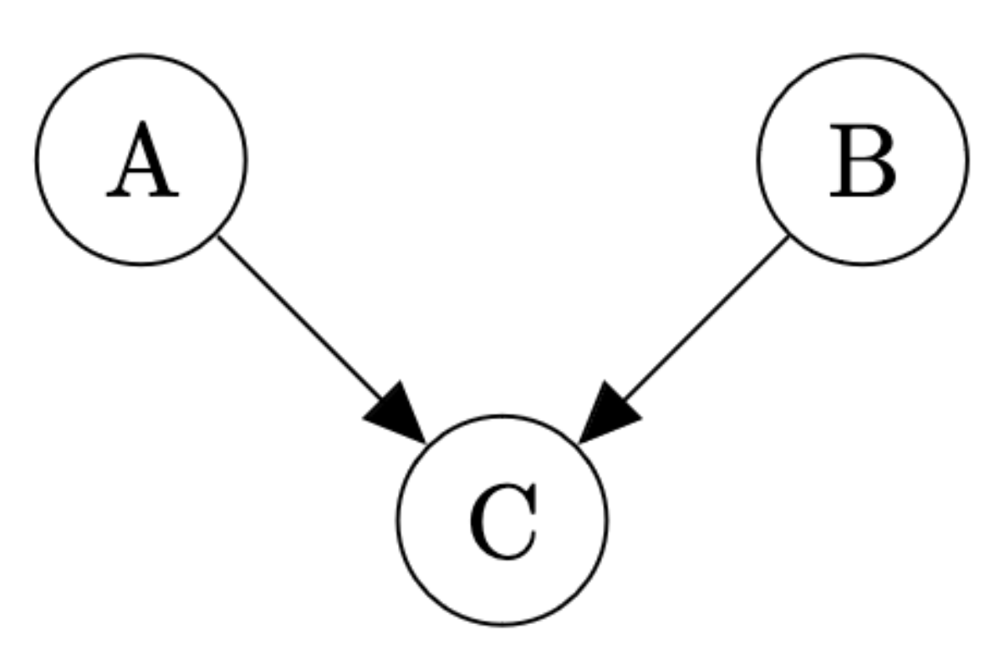
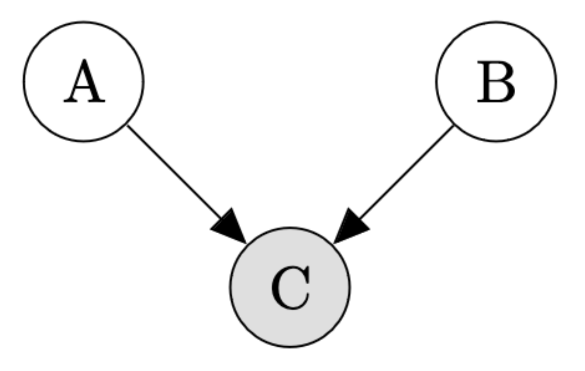
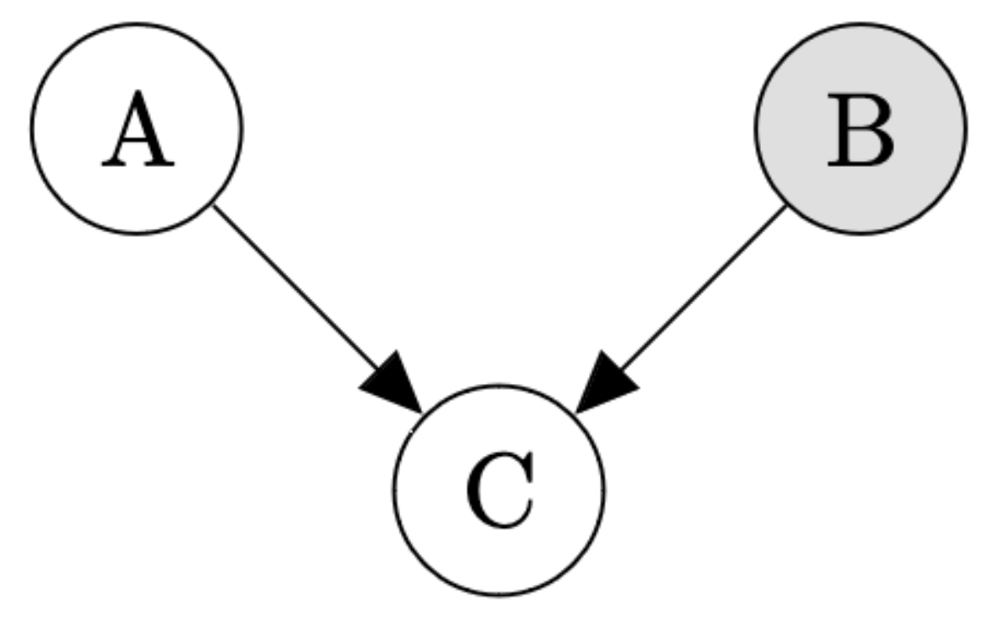
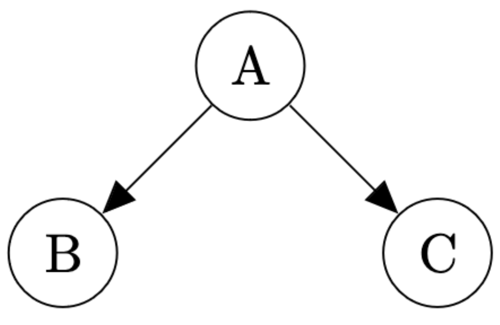
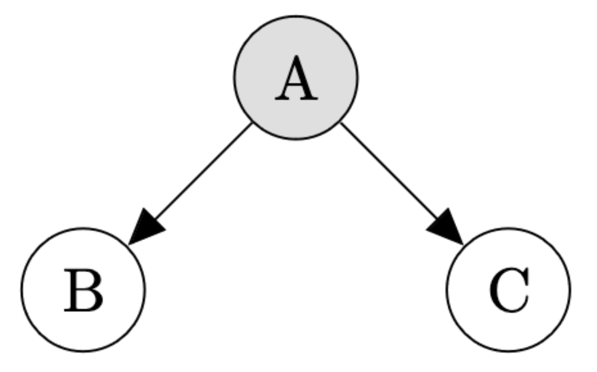
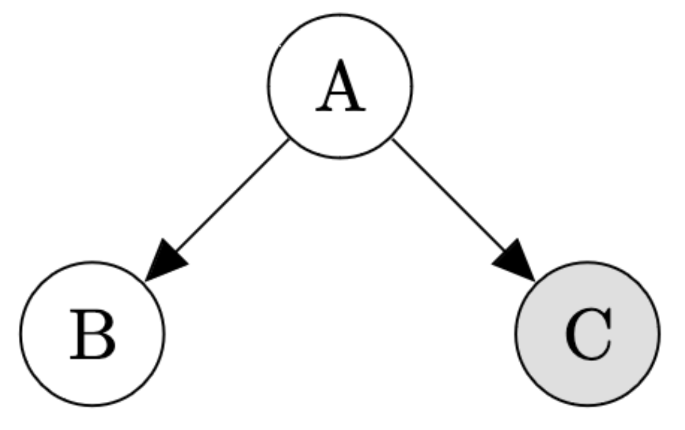

## Exercise 5.1: Epidemiology

Imagine that you are an epidemiologist and you are determining people's cause of death.

In this simplified world, there are two main diseases, cancer and the common cold.

* People rarely have cancer, $\Pr(\textsf{Cancer}) = 0.00001$. 
* People are much more likely to have a common cold: $\Pr( \textsf{Cold} ) = 0.2$.
* When people do have cancer, it is often fatal: $\Pr( \textsf{Death} \mid \textsf{Cancer}, \neg \textsf{Cold} ) = 0.9$.
* Having a cold is rarely fatal: $\Pr( \textsf{Death} \mid \textsf{Cold}, \neg \textsf{Cancer} ) = 0.00006$
* But having cancer and a cold is slightly more deadly than having cancer alone: $\Pr(\textsf{Death} \mid \textsf{Cold}, \textsf{Cancer}) = 0.91$.
* Very rarely, people also die of other causes: $\Pr(\textsf{Death} \mid \neg\textsf{Cold}, \neg\textsf{Cancer}) = 0.000000001$.

Write this model in WebPPL and use `Infer` to answer the following questions (Be sure to include your code in your answer):

### Question 5.1.1

Compute $\Pr( \textsf{Cancer} \mid \textsf{Death} , \textsf{Cold} )$ and $\Pr( \textsf{Cancer} \mid \textsf{Death} , \neg\textsf{Cold} )$.

How do these probabilities compare to $\Pr( \textsf{Cancer} \mid \textsf{Death} )$ and $\Pr( \textsf{Cancer} )$?

Using these probabilities, give an example of explaining away.

```{.js}
display("Prior:")
viz.table(
  Infer(
    {method: 'enumerate'},
    function() {
      ...
    }
  )
)
```

```{.js}
display("Death:")
viz.table(
  Infer(
    {method: 'enumerate'},
    function() {
      ...
    }
  )
)
```

```{.js}
display("Death and Cold:")
viz.table(
  Infer(
    {method: 'enumerate'},
    function() {
      ...
    }
  )
)
```

```{.js}
display("Death and No Cold:")
viz.table(
  Infer(
    {method: 'enumerate'},
    function() {
      ...
    }
  )
)
```

### Question 5.1.2

Compute $\Pr( \textsf{Cold} \mid \textsf{Death} , \textsf{Cancer} )$ and $\Pr( \textsf{Cold} \mid \textsf{Death} , \neg\textsf{Cancer} )$.

How do these probabilities compare to $\Pr( \textsf{Cold} \mid \textsf{Death} )$ and $\Pr( \textsf{Cold} )$?

Using these probabilities, give an example of explaining away.

```{.js}
display("Prior:")
viz.table(
  Infer(
    {method: 'enumerate'},
    function() {
      ...
    }
  )
)
```

```{.js}
display("Death:")
viz.table(
  Infer(
    {method: 'enumerate'},
    function() {
      ...
    }
  )
)
```

```{.js}
display("Death and Cancer:")
viz.table(
  Infer(
    {method: 'enumerate'},
    function() {
      ...
    }
  )
)
```

```{.js}
display("Death and No Cancer:")
viz.table(
  Infer(
    {method: 'enumerate'},
    function() {
      ...
    }
  )
)
```

## Exercise 5.2: Are They Independent?

For each question, determine whether the relevant variables are independent in the given Bayes Net. Here, grey nodes represent *observed* variables while white nodes represent *unobserved* variables.

### Question 5.2.1

Are $A$ and $B$ independent?

{fig-align="center" width="50%"}

### Question 5.2.2

Are $A$ and $B$ independent?

{fig-align="center" width="50%"}

### Question 5.2.3

Are $A$ and $C$ independent?

{fig-align="center" width="50%"}

### Question 5.2.4

Are $B$ and $C$ independent?

{fig-align="center" width="50%"}

### Question 5.2.5

Are $B$ and $C$ independent?

{fig-align="center" width="50%"}

### Question 5.2.6

Are $A$ and $B$ independent?

{fig-align="center" width="50%"}
